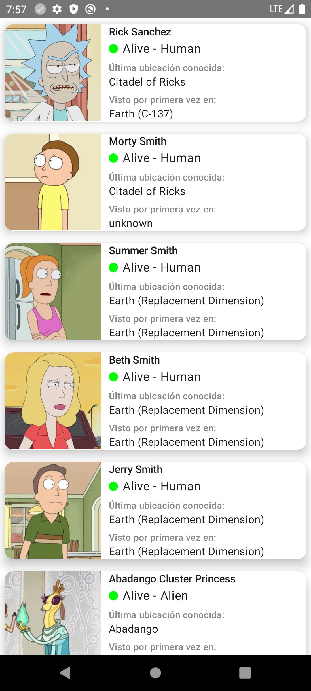
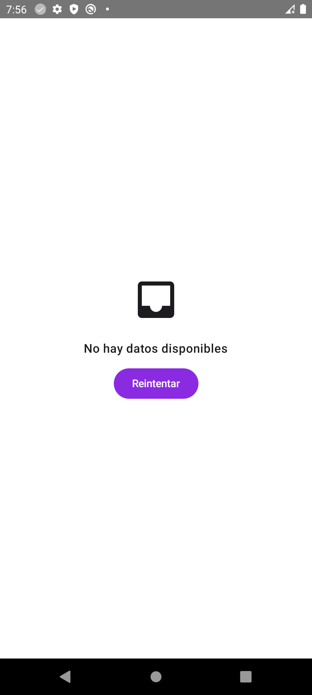
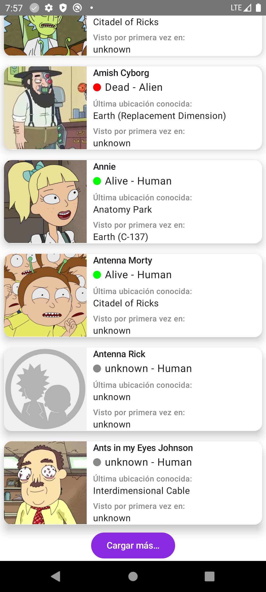

# Rick and Morty Wiki

## Descripción

Este proyecto es una aplicación para mostrar una lista de personajes del universo de *Rick and Morty*. La aplicación está construida utilizando las últimas tecnologías de Android, incluyendo Jetpack Compose para la interfaz de usuario, MVVM (Model-View-ViewModel) para la arquitectura de la aplicación, y Dagger-Hilt para la inyección de dependencias.

## Tecnologías Utilizadas

- **Jetpack Compose**: Para construir la interfaz de usuario de manera declarativa.
- **MVVM (Model-View-ViewModel)**: Para separar las responsabilidades en la arquitectura de la aplicación.
- **Dagger-Hilt**: Para la inyección de dependencias.
- **Retrofit**: Para la comunicación con el API que proporciona los datos de los personajes.
- **Kotlin Coroutines**: Para manejar las operaciones asincrónicas.

## Estructura del Proyecto

1. **Data Layer**:
    - **Repositories**: Encargados de manejar la lógica de acceso a los datos, ya sea desde una fuente remota (API) o local.
    - **API Service**: Definición de las interfaces para las llamadas a la API utilizando Retrofit.
    - **Use Cases**: Contiene la lógica de negocio específica de la aplicación. Los casos de uso interactúan con los repositorios para obtener y manipular datos.

2. **Presentation Layer**:
    - **ViewModels**: Gestionan el estado de la UI y comunican los datos entre la capa de dominio y la UI.
    - **UI Composables**: Componentes de Jetpack Compose que representan la interfaz de usuario.

## Decisiones de Diseño

1. **Uso de MVVM**:
    - **Motivación**: MVVM ayuda a mantener el código limpio y separado por responsabilidades. La vista (UI) está desacoplada de la lógica de negocio y la lógica de datos, lo que facilita la prueba y el mantenimiento.
    - **Implementación**: Los `ViewModel` manejan el estado y las acciones de la UI, mientras que los `Use Cases` contienen la lógica de negocio que interactúa con los `Repositories`.

2. **Inyección de Dependencias**:
    - **Motivación**: Utilizar Dagger-Hilt permite una inyección de dependencias fácil y automática, reduciendo el acoplamiento y facilitando la prueba.
    - **Implementación**: Se utilizan módulos para proporcionar instancias de los `Repositories`, `API Service` y otros componentes necesarios.

3. **Jetpack Compose**:
    - **Motivación**: Jetpack Compose permite construir interfaces de usuario de manera declarativa y reactiva, lo que simplifica el código y mejora la capacidad de respuesta de la aplicación.
    - **Implementación**: Se han creado composables para representar las listas de personajes y detalles individuales, utilizando estados y efectos para manejar la UI.

4. **Retrofit para API**:
    - **Motivación**: Retrofit simplifica la comunicación con el API RESTful para obtener datos de los personajes.
    - **Implementación**: Se ha configurado Retrofit con un cliente HTTP y se han definido las interfaces para las solicitudes de red.

## SCREENS

La pantalla principal del App donde puedes observar cada personaje, su estado, donde se vio por ultima vez y primera vez, nombre e imagen.

Pantalla cuando no hay datos de los personajes.

Pantalla de error

Cargar más personajes

